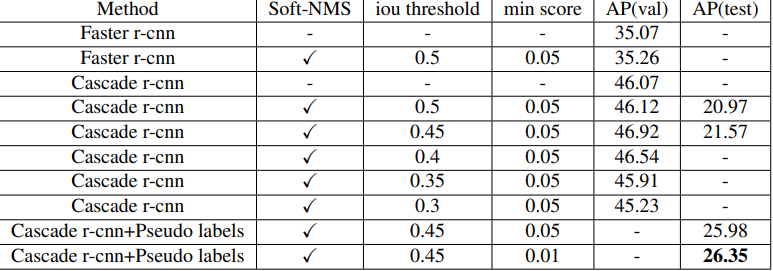

# The Implementation with MindSpore of CVPR 2022 SSHODC Challenge
**Paper Link:**   https://ieeexplore.ieee.org/document/9857095/

**Award certificate**

<p align="left">
  
</p>


## Introduction
Semi-supervised learning is a highly researched problem, but existing semi-supervised object detection frameworks are based on RGB images, and existing pre-trained models cannot be used for hyperspectral images. To overcome these difficulties, this paper first select fewer but suitable data augmentation methods to improve the accuracy of the supervised model based on the labeled training set, which is suitable for the characteristics of hyperspectral images. Next, in order to make full use of the unlabeled training set, we generate pseudo-labels with the model trained in the first stage and mix the obtained pseudo-labels with the labeled training set. Then, a large number of strong data augmentation methods are added to make the final model better. We achieve the SOTA, with an AP of 26.35, on the Semi-Supervised Hyperspectral Object Detection Challenge (SSHODC) in the CVPR 2022 Perception Beyond the Visible Spectrum Workshop, and win the first place in this Challenge.
	
### Experiments Results

<p align="left">
  
</p>

## Installation

### Dependency

- mindspore >= 1.8.1
- numpy >= 1.17.0
- pyyaml >= 5.3
- tqdm
- openmpi 4.0.3 (for distributed mode) 

To install the dependency, please run
```shell
pip install -r requirements.txt
```

### Prepare datasets


Please make sure the dataset is placed as shown below, where val_no_label.json represents the unlabeled portion of the training set

```text
mindspore_rooftophsi
├── data
│   ├── RIT-HS20
│   │   ├── annotationsjson
│   │   │   ├── instances_train_s10.json
│   │   │   ├── instances_test_id.json
│   │   │   ├── val_no_label.json
│   │   │   ├── test.json
│   │   ├── spectral
```

### Quickly Test
```shell


# test
bash run_eval_ascend.sh [VALIDATION_JSON_FILE] [CHECKPOINT_PATH]

# Submission.json will be generated in the current workspace directory

```

### Training


```shell
#  pre-training
python train.py --stage 1 

# Generate pseudo labels

python eval.py --checkpoint_path xxx.ckpt

mv submission.json data/RIT-HS20/annotationsjson/

python data/RIT-HS20/annotationsjson/pseudo1.py

python data/RIT-HS20/annotationsjson/pseudo2.py

# the second stage of training
python train.py --stage 2 

```

### Testing


```shell

# test
python eval.py --checkpoint_path xxx.ckpt

```

### Acknowledgement

This work is sponsored by Natural Science Foundation of China(62276242), CAAI-Huawei MindSpore Open
Fund(CAAIXSJLJJ-2021-016B), Anhui Province Key Research and Development Program(202104a05020007), and
USTC Research Funds of the Double First-Class Initiative(YD2350002001)

### Citation

If you find this project useful in your research, please consider citing:

```latex
@inproceedings{yu2022pseudo,
  title={Pseudo-Label Generation and Various Data Augmentation for Semi-Supervised Hyperspectral Object Detection},
  author={Yu, Jun and Zhang, Liwen and Du, Shenshen and Chang, Hao and Lu, Keda and Zhang, Zhong and Yu, Ye and Wang, Lei and Ling, Qiang},
  booktitle={Proceedings of the IEEE/CVF Conference on Computer Vision and Pattern Recognition},
  pages={305--312},
  year={2022}
}
```
